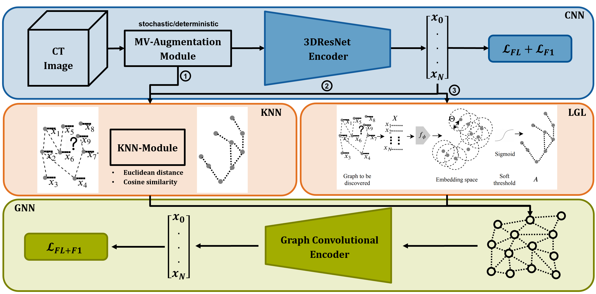

## Graph Neural Network Enabled Tumor Representation Learning
Effective feature extraction and learning of meaningful data representations constitute core elements that significantly contribute to the efficacy of subsequent downstream tasks in medical imaging. These tasks encompass vital aspects including diagnosis, prognosis, and characterization, thereby potentially facilitating the personalization of cancer therapies on an individualized basis. To this end, we direct attention to the task of learning a meaningful yet robust global imaging descriptor based on Graph Convolutional Neural Networks (GCNs) to integrate versatile augmented tumor representations obtained by a Convolutional Neural Network (CNN) encoder. Therefore, we devise an augmentation-graph, with various augmented tumor representations constituting the nodes of the graph, for which the underlying optimal graph structure will be learned towards the GCNs downstream task. Given the augmentation-graph, the underlying residual GCN hierarchically learns discriminative global imaging descriptors considering relations of multiple tumor augmentations. Our findings substantiate notable enhancements in classification employing the proposed augmentation-based GCN feature fusion on two computer-aided diagnosis problems in medicine. Furthermore, the robustness of the learned global tumor representation is validated by means of variational node dropout and external test set evaluation.

  

